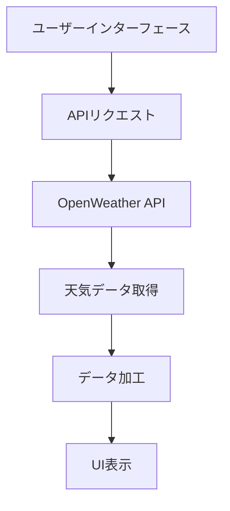

# 天気予報アプリ設計書

## システム構成

## 主要コンポーネント
### 検索フォーム
- 都市名入力フィールド
- 検索ボタン
- 現在地取得ボタン（Geolocation API）

### 天気表示カード
- 現在の天気セクション
- 5日間予報セクション（時間別/日別）

### API連携モジュール
- OpenWeather APIクライアント
- データフォーマット変換
- エラーハンドリング

## UIデザイン要件
- カラースキーム：ブルー基調（天候イメージ）
- レスポンシブグリッドレイアウト
- モーダルダイアログ（エラー表示用）
- ローディングインジケーター

## API仕様
- 使用エンドポイント：
  - Current Weather Data
  - 5 Day Weather Forecast
- 必要パラメータ：
  - APIキー
  - 都市名/緯度経度
  - 単位（metric）

## データフロー
1. ユーザー入力受付
2. APIリクエスト発行
3. レスポンスデータ加工
4. UIコンポーネント更新
5. エラー発生時処理
